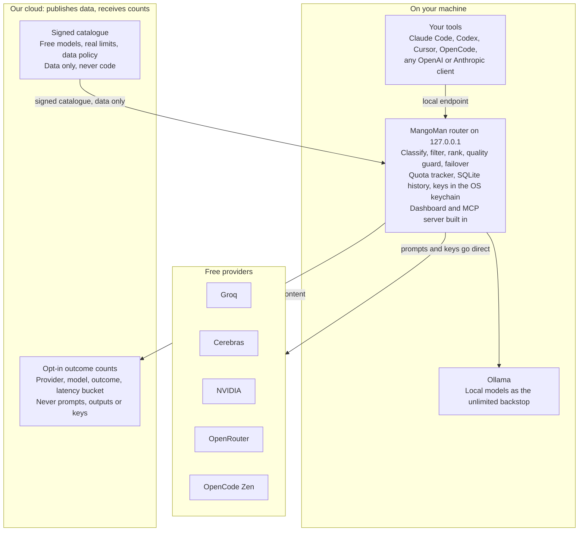

# MangoMan: Technical PRD

Oct 6, 2026 · MANGO

MangoMan is a free, local-first AI router that pools every free model a builder can reach, switches automatically when one runs dry, and never holds their keys or sees their prompts.

## Problem and pain points

There is a lot of free AI capacity in 2026, but it is scattered across a dozen providers, each with its own limits, terms and data policy, and it changes every week. Builders either pay for convenience or spend hours stitching free tiers together by hand.

**Problem statement:** a builder, tester or small business that wants to run AI for free has no single, safe, always-available way to use all the free models they are entitled to.

| # | Pain point | What happens today |
| --- | --- | --- |
| 1 | Fragmented free capacity | Free tiers sit at Groq, Cerebras, OpenRouter, OpenCode Zen, NVIDIA, SiliconFlow, Z.ai, GitHub Models and more. Each needs its own account, key and code path. |
| 2 | Hard limits hit mid-task | Each free tier caps requests and tokens per minute and per day. An agent run dies when one provider returns 429, even though other free capacity exists. |
| 3 | Constant churn | Free models appear and vanish without notice (Ox Alpha went from free stealth preview to paid GLM-5.3-Flash within weeks; Cerebras cut its free catalogue from about a dozen models to two). |
| 4 | Unpublished limits | Some providers, such as OpenCode Zen, do not publish free-tier limits at all, so builders learn them by failing. |
| 5 | Hidden data risk | Data policies differ per model, even inside one provider: some retain prompts, some train on them, some are processed in China. Few builders check. |
| 6 | Gateways hold your keys | Hosted gateways see every prompt and hold every key. Self-hosted gateways put all keys on one server: LiteLLM had a PyPI supply-chain compromise and two exploited CVEs in 2026. |
| 7 | Paid by default | Existing routers optimise price among paid options. None routes to free first and pays only as a last resort. |
| 8 | Silent quality failures | Tools fail over on errors, but not on empty answers, refusals, broken JSON or truncated output, which are common on free models. |

The result: free AI is real but unusable at scale without a dedicated layer that pools it, watches it and protects the user.

## Users and jobs to be done

The first users are individual builders and small teams who run AI daily and want it free; small businesses follow once the non-developer app ships.

| User | Job to be done | What they need from us |
| --- | --- | --- |
| Indie developer / builder | Build and run apps and agents without an AI bill | One endpoint for all free models, automatic failover, works in Claude Code, Codex, Cursor, own code |
| Tester / QA engineer | Test prompts and features across many models | Side-by-side comparison, new-model alerts, test generation |
| AI agent builder | Keep long-running agents alive on free capacity | Quota-aware routing, bad-answer failover, quota forecast |
| Small business / non-developer | Daily AI tool use (writing, analysis, support) for free | Desktop app and web chat, no code, safe defaults |
| Small dev team | Share a setup without sharing secrets | Team rules and settings synced, keys stay on each machine |
| AI labs (later) | Get testers for preview and stealth models | A channel to reach active builders and collect feedback |

**Not targeted in v1:** enterprises needing SLAs and central billing, and heavy production traffic that exceeds pooled free quotas.

## Product principles

Five rules decide every design trade-off; a feature that breaks one does not ship.

1. **Free-first, free-only by default.** A paid model is called only if the user turns on "paid fallback", which is off by default. When free capacity is exhausted, requests go to a local model or wait for quota reset, with a clear message.
2. **Keys never leave the user's machine.** Provider keys live in the OS keychain. Our servers never receive, store or proxy them in the default product.
3. **Prompts never touch our servers.** Traffic goes directly from the user's machine to each provider. We see only opt-in, anonymous health signals (success, error code, latency bucket), never content.
4. **Neutral.** We have no model inventory to sell and earn nothing from routing to any provider, so routing decisions serve the user only.
5. **Transparent.** Every response is traceable locally: which provider, which model, why it was chosen, what it cost (nothing), and that model's data policy.

These principles are also the business logic: with no keys, no prompts and no traffic on our side, running costs stay near zero, which is what makes "free forever" credible.

## Competitive landscape

Model routing is proven and valuable: Stripe agreed in August 2026 to buy OpenRouter for a reported \~$7.5B. But every major player is a hosted middleman or a self-hosted server that concentrates keys, and none routes free-first across providers.

| Player | What it is | 2026 status | Gap we exploit |
| --- | --- | --- | --- |
| [OpenRouter](https://openrouter.ai) | Hosted marketplace and gateway, 400+ models | $1.3B valuation after $113M Series B (May 2026); Stripe acquisition announced Aug 19, 2026, reported \~$7.5B; \~8M users, \~100T tokens/month | All traffic passes through it; switching stays inside its network; own free models capped (\~50 requests/day); now owned by a payments company that earns on paid traffic |
| [OpenRouter Ori, Spawn, Agent SDK](https://openrouter.ai/docs/guides/ori/harness) | Ori runs 12 agent CLIs (Claude Code, Codex, OpenCode, Hermes and others) on OpenRouter models; Spawn hosts agents on the user's cloud; Agent SDK (TS, Python, Go) to build agents; Ori Eval picks the best model for a project | Live, Oct 2026 | Paid-first and billed through OpenRouter; no free-tier pooling across providers; no QA agent, test generator or Guardian; Ori Eval overlaps our personal evals (now lower priority) |
| [LiteLLM](https://www.litellm.ai) (BerriAI) | Open-source, self-hosted gateway, 100+ providers | \~$7M ARR reported on $1.6M disclosed seed; PyPI compromise (Mar 2026), CVE-2026-42208 SQL injection (Apr), CVE-2026-42271 RCE exploited (Jun, fixed in 1.83.7) | One server holds every key; weak security record; no awareness of free-tier daily quotas or catalogue churn; heavy ops burden |
| [OpenCode Zen](https://opencode.ai/docs/zen/) | Hosted gateway behind the OpenCode coding agent | 10 free models (Oct 2026), almost all "free for a limited time"; limits not published; most free models may train on prompts (only Space Bunny and LongCat promise zero retention) | One pool only; coding-first; hosted; no cross-provider failover; free set chosen by the vendor |
| [OpenCode (agent)](https://opencode.ai/docs/tools/) | Open-source (MIT) coding agent: terminal, desktop app (beta), IDE extension, web; plan and build modes, web search and fetch, MCP, any model | About 190,000 GitHub stars and 950 contributors (mid-2026) | Partner, not rival: it is the tool, we are the free supply. Alone it has only Zen's small, temporary free pool; we bundle it as our coding engine and add pooled free tiers, failover, QA and Guardian |
| [Jev (TypeSafe)](https://github.com/vinilana/jev-gateway) | Fast decision model: answers yes/no, choice and score questions in a fraction of a second with calibrated confidence; a gateway uses it to pick coding agents' tool calls | jev-1.13 free on OpenCode Zen for a limited time; paid $0.042 per million input tokens | Not a competitor: the model for our decision brain's design, and one optional engine for it (swappable for a fast Groq model or a local model) |
| [Portkey](https://portkey.ai) | "Control plane for production AI" gateway | $15M Series A (Feb 2026) | Built for paid enterprise traffic; not free-first; hosted by default |
| Cloudflare AI Gateway | Gateway add-on to Cloudflare | Mature platform feature | Hosted; no free-tier pooling; no local option |
| Vercel AI Gateway | Gateway add-on to Vercel | Mature platform feature | Hosted; paid-model focus |

Our position is the one nobody holds: **local, free-first, across everyone, OpenRouter and Zen included as supply sources.**

How we answer the common questions:

- **"OpenRouter already does this."** Not Flipkart vs Amazon: OpenRouter is one store (its free tier is about 50 requests a day, 1,000 after buying $10 of credits, and every request passes through its servers). MangoMan is not a store; it runs on the user's machine and pools the free tiers of every provider, OpenRouter included.
- **"How are we different from LiteLLM?"** LiteLLM is a do-it-yourself gateway for teams managing paid spend. MangoMan is ready-made and free-first: it knows every free tier, learns real limits live, switches on bad answers, and later adds QA agents and Guardian.
- **"OpenCode already codes, researches and chats."** OpenCode builds your app; MangoMan keeps it free to build, then tests it and keeps it running. We use OpenCode as our coding engine instead of competing with it.
- **"Are we an LLM?"** No. We do not train or own a model. MangoMan is an AI product powered by many models; the judgment (routing, understanding, skill packs, checking) is ours.
- **"Do users need a Claude or Codex subscription?"** No. The tools are free to install; a subscription pays for Anthropic's or OpenAI's models. Without one, MangoMan runs the tools on free models; with one, assist mode makes it last longer.

## Feature comparison

OmniRoute, an open-source router (about 72k stars, MIT), now also keeps keys local and routes free-first across hundreds of providers, so the router alone is no longer our edge. We lead on finished, checked work on free AI for non-developers: failover on bad answers, not just errors; skill packs whose scripts check every output; data-policy labels per model; Guardian and the QA agent; a creator marketplace; and an app built for non-technical Indian users. Competitor cells reflect public docs as of Sep 2026; "Partial" means limited to the vendor's own network or requiring manual setup. (P2), (P3), (P4) mark the roadmap phase in which a feature ships.

| Feature | MangoMan | OpenRouter | LiteLLM | OpenCode Zen | Portkey | Cloudflare AI GW |
| --- | --- | --- | --- | --- | --- | --- |
| Keys never leave the user's machine | Yes | No | Self-hosted server | No | Self-host option | No |
| Prompts never pass through the vendor | Yes | No | Yes (self-hosted) | No | Self-host option | No |
| Free-first routing (paid only as opt-in fallback) | Yes | No | No | No | No | No |
| Pools free tiers across all providers and accounts | Yes | Partial (own free models) | Partial (manual) | Partial (own set) | No | No |
| Free-tier quota tracking (per minute and per day) | Yes | No | Partial (per-minute limits you configure) | No | No | No |
| Quota forecast ("free capacity lasts until 6 pm") | Yes (P2) | No | No | No | No | No |
| Failover on provider errors | Yes | Partial (inside its network) | Yes | Not documented | Yes | Yes |
| Failover on bad answers (empty, refusal, broken JSON, truncated) | Yes | No | No | No | Partial (guardrails) | No |
| Same model on another provider first | Yes | Yes (own providers) | Manual | No | Manual | No |
| Multi-model answers (ask 2-3, pick best) | Yes (P2) | No | No | No | No | No |
| Fit-to-model (compress or split long prompts) | Yes (P2) | Partial (prompt compression transform) | No | No | No | No |
| Local models (Ollama) as unlimited backstop | Yes | No | Yes | No | Yes (self-host) | No |
| Live catalogue and new-model radar | Yes | Partial (own listings) | No | Partial (own set) | No | No |
| Measured real limits and health map (crowd-sourced, no prompts) | Yes (P2) | Partial (provider uptime pages) | No | No | No | No |
| Per-model data-policy labels and filters (training, retention, jurisdiction) | Yes | Partial (training filter) | No | Documented, no filter | No | No |
| Works with Claude Code, Codex, Cursor, any OpenAI or Anthropic client | Yes | Yes | Yes | Partial (OpenAI format) | Yes | Yes |
| MCP "assist" mode (offload work from a paid main model) | Yes | No | No | No | No | No |
| My list (preferred models first) and strict mode / model groups for consistent workflows | Yes | Partial (fallback list per request) | Partial (config) | No | Partial (config) | No |
| Built-in coding workspace on free models | Yes (OpenCode engine; launcher P1, workspace M6) | Partial (Ori runs other agents, paid) | No | Yes (OpenCode, small free pool) | No | No |
| Smart layer: understands the request, applies skill packs, verifies the output | Yes (P1.5 to P2) | No | No | No | Partial (guardrails) | No |
| Raw data to dashboards and CEO decks | Yes (P2) | No | No | No | No | No |
| Key health manager (validity, expiry, guided sign-up) | Yes | No | No | No | No | No |
| Team mode without sharing keys | Yes (P4) | No (shared org keys) | No (central keys) | No | No (central keys) | No |
| Test generator, QA agent, code review | Yes (P2) | No | No | Yes (coding agent) | No | No |
| Plug-and-play agent marketplace | Yes (P3) | No | No | No | No | No |
| Self-healing app monitor (Guardian) | Yes (built) | No | No | No | No | No |
| Works offline | Yes (P4, local models) | No | Partial | No | Partial | No |

OmniRoute, an open-source router, also rotates several keys per provider and skips a key that hits its limit. MangoMan's team keys match that and add per-key status, a notice for each key's owner and a per-provider off switch.

## Feature list by layer

The product is one platform in four layers; every layer runs on the user's machine or infrastructure with the user's own keys, so each add-on stays free to offer.

### Layer 1: the router (core)

| Feature | Description | Phase |
| --- | --- | --- |
| Free-first routing | Routes every request to the best available free model for its task; paid fallback is opt-in and off by default | P1 |
| Pooled free capacity | Combines free tiers across all connected providers and accounts, plus local Ollama models | P1 |
| Quota tracking | Tracks requests and tokens per minute and per day per provider, account and model; moves on before a limit is hit | P1 |
| Failover on errors | Retries on 429, 5xx, timeouts; same model on another provider first, then an equivalent model | P1 |
| Failover on bad answers | Detects empty output, refusals, invalid JSON or tool calls, truncation; retries on the next candidate | P1 |
| Works with any tool | Local endpoint speaking Anthropic Messages, OpenAI Responses and OpenAI Chat Completions | P1 |
| New model radar | Lists every connected provider's models every 6 hours; free models not yet in the catalogue appear in a floating "New models" list on the dashboard (marked New for 14 days) and are added to My list in one click; warns before a model leaves the free tier | P1 |
| Key health manager | Guided sign-up to 10+ free providers, key validation, expiry and revocation alerts | P1 |
| Data-policy filters | Per-model labels (retention, training, jurisdiction); every provider and model on by default; optional per-user exclusions | P1 |
| MCP assist mode | Paid main model (Claude, GPT) keeps control and offloads cheap work to free models through MCP tools | P1 |
| My list | The user's ordered preferred models, tried first; when they are used up the router stops and asks before using any other model (allow for 1 hour or always). With no list it uses its own ranking. Entry = model name (any provider) or provider/model | P1 (built) |
| Strict mode and model groups | For workflows that need consistent output: strict/\<model> uses only that model; group/\<name> uses only a tested set in the user's order. Never switches outside; returns 429 with the reset time when used up | P1 (built) |
| Measured-speed routing | After two good answers a model's real response time replaces the catalogue estimate, so slow or overloaded models sink in the ranking | P1 (built) |
| Multi-model answers | Asks 2-3 free models in parallel and picks the best or majority answer | P2 |
| Fit-to-model | Compresses, summarises or splits long prompts to fit small free context windows, or routes to a long-context model | P2 |
| Quota forecast | Predicts when free capacity runs out and suggests which provider to connect | P2 |
| Personal evals | Users keep a small set of their own tasks; new models are auto-tested on them | P2 |
| Team keys (one machine) | Several people working from one computer each add their own key, for any provider. Requests take turns across every key of a model; a key at its limit rests until its reset and the next key carries on with the same model; a rejected key drops out on its own. Per-key status and requests today on the dashboard; the live panel and a response header say whose key answered. A notice is shown before a team key is saved, and team keys can be switched off per provider from the signed catalogue | P1 (built) |
| Team mode | Each person on their own device: shared routing rules and settings, never shared keys | P4 |
| Offline mode | Automatic switch to local models when there is no internet | P4 |

### Layer 2: built-in tool suite

| Tool | Description | Phase |
| --- | --- | --- |
| Coding workspace (OpenCode engine) | We do not build our own coding agent. P1: mangoman code opens the open-source OpenCode agent (MIT) already wired to MangoMan (built). M6: a MangoMan-branded coding screen (chat, plan and build, file changes, terminal, approvals) with OpenCode running headless underneath, credited in About under its MIT licence | P1 launcher, M6 workspace |
| Test case generator | Reads code, APIs or requirements; generates unit, integration and edge-case tests | P2 |
| QA agent | Runs tests, explores the app with browser automation, files bug reports with repro steps | Built (mangoman qa) |
| Code review and security scan | Reviews diffs before commit; flags bugs, leaked secrets, risky dependencies | P2 |
| Docs and changelog writer | Generates docs and release notes from commits | P2 |
| Data to dashboards and decks | Takes raw data (CSV, Excel, exports), profiles and cleans it in code, computes the numbers in code (never estimated by a model), finds the story, and builds an interactive dashboard or a CEO-ready slide deck; every figure is checked against the data before delivery | P2 |
| Document and design builds | Resumes, landing pages, reports and similar outputs built from skill packs (tested layouts and quality rules), rendered and visually checked before delivery | P2 |

### Layer 3: plug-and-play agents

- **Agent marketplace:** free skill packs for every agency skill plus paid advanced agents sold by subscription, built by us or outside developers, with a revenue share for MangoMan (see Skill packs and agent marketplace). Phase 3.
- **Third-party runtimes as plug-ins:** Hermes Agent (MIT-licensed) supported directly; OpenClaw only inside a sandbox, given its security history.
- **Own agent kit** on LangGraph for agents we build and maintain.
- **Safety rule:** every community agent is signed, sandboxed and declares its permissions (files, network hosts, tools) before install.

### Layer 4: Guardian, the self-healing monitor (built; first real-model run pending)

1. **Monitor** uptime, error logs, crashes, slow endpoints and failed jobs of the developer's app.
2. **Triage** with an AI agent that reads the error, stack trace and recent commits to find the likely cause.
3. **Heal** in two steps: first aid from the owner's list of safe actions (restart, retry); then the real fix. Guardian finds the root cause and fixes it on its own branch, the QA agent writes a test, and both are tested in a development copy for up to 3 rounds with no approval needed. A fix that passes goes to production only after the owner approves it on Telegram. It is tested again in production and rolled back if it fails.
4. **Report** at 08:00 and 20:00 every day, also on quiet days, by Telegram and webhook: what broke, why, what Guardian did, what waits for approval.

Guardian runs on the user's own infrastructure (their server, or a scheduled GitHub Actions job), not ours, so logs and keys stay with them.

### Apps and surfaces

| Surface | Description | Phase |
| --- | --- | --- |
| Local dashboard (tray icon with the P4 desktop app) | Connections, My list, new-models list, requests per hour, every model's state and limits, recent requests (built, served by the router itself); savings and settings next | P1 |
| CLI | `init`, `keys add`, `status`, `radar`, `test` | P1 |
| Website | Catalogue, radar, onboarding, docs, community | P1 |
| Web chat and model arena | Browser-only chat and side-by-side comparison; keys stay in the browser | P3 |
| Non-developer desktop app | Chat, documents, everyday tools for small businesses | P4 |
| Cloud mode | Hardened hosted router for users who cannot install anything (opt-in) | P4 |

## Smart layer (Jev-style intelligence)

Every request passes through a smart layer that understands it before any model works and checks the result before the user sees it; the models are borrowed, the judgment is ours. It follows the Jev approach: small, typed decisions (yes/no, pick one, a score) made in about a second, not one model freely rewriting everything, which keeps it fast, repeatable and hard to break.

1. **Understand (input brain).** Typed decisions: what the user wants (app, document, research, data analysis, code fix, design), whether anything is unclear (then ask at most two sharp questions), whether research comes first, which skill pack applies, which model tier fits.
2. **Build the prompt.** The user's words are kept exactly, plus their answers and the skill pack's expert instructions, quality rules and examples. Mostly fixed templates, never free rewriting; the user can always see "how I understood it".
3. **Do the work.** Free models through the router; a strong model plans and fast models do the simple steps (the Jev split, for example choosing which tool to call).
4. **Check (output brain).** Requirements coverage is scored; code is run and its tests executed; designs are rendered and the screenshot checked; numbers are recomputed from the data; facts need sources. Below the bar, only the gap is redone (at most two rounds), then the result is delivered with a short check summary (for example "runs, 6 of 6 requirements").

**Rules:** never hide the user's original request; ask instead of guessing when it matters; verify by doing (run, render, recompute), not by asking a model whether its own work is good.

### Decision brain engine (swappable slot)

| Engine | Strength | Caveat |
| --- | --- | --- |
| Jev 1.13 (TypeSafe, via OpenCode Zen) | Built for typed decisions, sub-second, calibrated confidence | Free only for a limited time; Zen needs billing details; training on free prompts not ruled out |
| Fast Groq model (gpt-oss-20b class) | Fast, generous free tier, already connected for most users | General model, less calibrated |
| Small local model (Ollama, qwen3:4b class) | Private, offline, unlimited | Slower on weak machines, lower accuracy |

### First skill packs

| Skill pack | What it brings | How the result is checked |
| --- | --- | --- |
| Resume | Asks role, creative or ATS-safe, one page; tested layouts, type and spacing rules, achievement wording with numbers | Rendered to PDF; fits one page, no overflow, readable, every section filled |
| Data to dashboard | Profiles and cleans data in code; picks charts by the shape of the data; a consistent colour system | Every figure recomputed from the data; charts rendered and screenshot-checked |
| CEO deck | Story first (the answer, then the three facts behind it), one message per slide, executive layouts | Every number traced to the data; slides rendered, no overflow, consistent styling |
| Landing page | Tested section layouts, copy rules, mobile-first | Rendered at phone and desktop width; no horizontal scroll, contrast checked |
| Simple web app | Plan file, project structure, tests first | App starts, tests pass |
| Research report | Plan, sources opened (not snippets), claims linked | Every claim has a source; dates checked |

**Order:** (1) decision brain plus backend checks, built Oct 2 (task type and non-answer decisions); (2) the understand step plus the resume, dashboard and deck packs, built Oct 2 (the understand step lives in each pack as questions to ask first); (3) visual checks (P2). The resume and the CEO deck are the planned demos for the non-developer app.

## Skill packs and agent marketplace

Every skill an agency sells gets two tiers: a **free skill pack** anyone can use on free models, and **paid advanced agents**, built by us or by independent developers and sold by subscription in a marketplace where MangoMan takes a share. The router stays free; the marketplace is how MangoMan earns.

|  | Free skill pack | Advanced agent (paid) |
| --- | --- | --- |
| What it is | Expert instructions, layouts, quality rules and checks for one skill | A multi-step specialist that does the whole job end to end, with its own tools and data sources |
| Quality bar | As good as a top general assistant (Claude, ChatGPT) on that task | Best in class: must beat the free pack and general assistants on the skill's published test set |
| Example: Amazon listing | Rewrites title, bullets and description to the marketplace's rules and character limits | Pulls the live listing and top competitors, researches keywords, finds gaps, rewrites, checks compliance, scores before and after, prepares the upload file |
| Built by | MangoMan, open to all | MangoMan or marketplace developers |
| Runs on | Free models through the router | Free models by default; any paid model or data source it needs is stated before purchase |
| Price | Free | Monthly subscription set by the developer; MangoMan keeps a share (to decide) |

### Agency skills to cover

Free packs roll out in waves; advanced agents follow per skill.

| Skill area | Free skill packs | Advanced agent idea |
| --- | --- | --- |
| Social media | Post sets and captions per platform, hashtags, content calendar | Monthly calendar from brand voice and trends, ready-to-schedule exports, performance review |
| Email marketing | Campaign copy, subject lines, newsletters | Full campaign: segments, sequences, A/B variants, spam and deliverability checks |
| E-commerce listings | Amazon, Shopify and marketplace listing optimisation, product descriptions | Listing optimiser with keyword research, competitor gaps, compliance checks, bulk catalogues |
| SEO and content | Blog articles, meta tags, briefs | Topic-cluster plan, briefs, articles and on-page audit |
| Paid ads | Ad copy variants, keyword lists | Campaign structure, creative variants, budget plan, weekly optimisation notes |
| Design and web | Landing page, brand kit, resume | Landing-page builder with A/B variants and speed checks |
| Data and reporting | Data to dashboard, CEO deck, monthly client report | Monthly client reporting from connected data sources |
| Business documents | Proposal, quote, invoice, cover letter, meeting minutes | Proposal writer with pricing tables and past-work references |
| Software | Simple web app, code review | QA agent, Guardian (built) |

### How the marketplace works

1. **Build.** Developers use our agent kit (or any runtime as a signed package) and declare permissions, tools, data sources and models.
2. **Review.** Automated security scan, sandbox run and a quality eval on the skill's public test set; only agents that beat the free pack list as Advanced.
3. **List.** Description, before-and-after examples, eval score, permissions, data policy and price.
4. **Subscribe and run.** The agent installs into MangoMan and runs in the sandbox; model calls go through the user's own MangoMan, free models first.
5. **Get paid.** Monthly payouts through a marketplace payment provider (Stripe Connect or Razorpay Route), MangoMan's share deducted.
6. **Stay good.** Ratings, a refund window, and the eval re-run on every update; agents that fall below the bar are delisted.

**Where an agent runs** is the key design choice: on the user's machine fits local-first but lets users read the agent's instructions, so a developer's know-how can be copied; logic hosted by the developer protects that know-how but sends the user's data off their machine. Proposal: allow both, labelled like models ("Runs on your machine" or "Runs in the developer's cloud", with its data policy).

**Phasing:** all 17 free packs are built. The agent kit, sandbox, test-set scoring and the first in-house advanced agent (Amazon listing pro) are built (3 Oct). Next: more test sets and in-house agents per skill area, then the marketplace (listing site, creator portal, review pipeline), then payments and payouts.

### Agent kit as built (3 Oct)

| Part | How it works |
| --- | --- |
| Package | A skill folder plus agent.json: name, version, the free pack it must beat, author, runs on (local or developer cloud with an https endpoint), network hosts, programs, models (free or paid), monthly price in rupees, data policy |
| Signing | Each creator makes an Ed25519 key (mangoman agents keygen) and signs a .mmagent package (mangoman agents pack); install checks the signature, every file's SHA-256, unsafe paths and size, and refuses an update signed by a different key |
| Sandbox | Scripts run only through mangoman agents exec: a Python audit-hook guard allows only declared hosts and programs, writes only in the work folder and the agent's own temp folder, blocks reading SSH, cloud, browser and MangoMan secrets, and removes secret and proxy variables; on Linux an agent with no network also runs in a namespace with no network. mangoman code denies running agent scripts directly |
| Reuse | An installed agent gets its free pack's scripts and the shared helpers, so creators build on tested renderers and checkers |
| Scoring | A free pack can carry a public test set (tests/cases, tests/score.py). mangoman agents eval runs the pack and the agent on every case through the same headless OpenCode and lists the agent as Advanced only if it scores higher on average and scores on every case. A GitHub workflow runs this with real free models |
| First test set | E-commerce listing: 3 Indian products (mango pulp, cotton kurta, steel bottle) with facts, a search term report, competitor listings and the current listing; score = rules 40, demand-weighted keyword coverage 30 (searches needing a claim the facts do not make are left out), title 15, completeness 15 |
| First agent | Amazon listing pro: keyword research from the seller's own report by orders and clicks, competitor gaps, the top search leading the title, backend terms filled to 249 bytes without unsupported claim words, and a before-and-after demand report |

Still open: MangoMan's share of subscriptions, the marketplace's own signing key (countersigning reviewed agents), and whether developer-cloud agents are allowed at launch.

## MangoMan app for everyone (M5)

The router and skill packs are the engine. Most of our audience is not technical: teachers, students, job seekers, shop owners and small businesses across India, many of whom have only heard about AI from friends. M5 puts a simple chat app on top of the engine so anyone can make things with normal prompts, such as "I am a school teacher, make a lesson plan on photosynthesis for class 7, and a PPT".

**Where it runs:** a website and a desktop app first, a mobile app later. The website also works in a phone browser. The local router stays for technical users. M5 is currently parked (see the build log).

| Today (technical) | MangoMan app |
| --- | --- |
| Install from the terminal | Open a website or install the desktop app |
| Copy keys from provider sites | Sign in with Google or a mobile number (OTP); free AI connects in one tap through OpenRouter's sign-in flow, so there are no keys to copy |
| Pick a skill pack | Type or speak the request; MangoMan picks the packs |
| Spec files and flags | 2 or 3 questions shown as tap buttons, with a Skip option |
| Files in a folder | Preview cards with Open, Download, Download all and Share on WhatsApp; changes asked for in plain words |
| English only | English, Hindi and Hinglish first; more Indian languages later |

**What M5 needs:** the chat app (login, chat, question buttons, file previews, sharing, languages, voice input); a server that runs the skill packs (they render PDFs, PPTs and images, which a phone cannot do alone); everyday packs (lesson plan, worksheet and quiz for teachers, school project, biodata, shop poster) plus general chat, research and data analysis.

**Free limits:** a shared free account would run out in minutes. Each user connects their own free AI account for their own daily limit; a small free trial allowance from us covers people who skip that step.

**Responsibilities as a service:** we run servers and keep accounts, so we need a privacy policy that follows India's DPDP Act, abuse limits, and no ads or sale of data.

### Chat history (proposed 3 Oct)

Saved to the user's account and synced between web and desktop; the desktop app keeps a local copy that opens offline. Saved: messages, question answers and every file made, linked to its chat. Recent list by day, search, pin, a My files page, and carrying on an old chat. Long chats are summarised for the model behind the scenes. Users can rename, delete one or all, download everything, use a temporary chat that is never saved, and pick auto-delete (3 months, 1 year, never). Optional memory comes later. The local router still stores no prompts or answers.

| What | Where | Why |
| --- | --- | --- |
| Accounts and chat text | Managed Postgres in the Mumbai region (Supabase), each user able to read only their own rows | Fast in India, sign-in included, cheap: text is about 1 MB per active user a month |
| Made files (PDF, PPT, images) | Object storage (Cloudflare R2), private paths, short-lived download links | $0.015 per GB a month and free downloads, so sharing and re-downloading cost nothing |
| File recipes (the JSON spec each file was built from) | With the chat text, kept as long as the chat | A few KB each; the renderers are deterministic, so an expired file is rebuilt the same in one tap |
| Desktop copy | A local database and folder on the user's computer | Works offline, fast to open |

Rendered files are kept 90 days and rebuilt from their recipe after that. Rough storage cost at 10,000 active users: chat text about 10 GB a month and files about 1.2 TB at any time, roughly $20 a month for files plus the $25 Pro plan and database growth; AI and rendering servers cost far more than storage. India's DPDP Act has no blanket rule to store data in India (the government can restrict transfers to named countries); most duties apply 18 months after the rules were notified on 13 Nov 2025. We use the Mumbai region anyway.

**Storage options still open (parked 3 Oct):** (a) Supabase Mumbai for accounts and chats; (b) Cloudflare D1 instead, split into many small databases of about 1,000 users each (free 5 GB, then $5 a month with 5 GB and $0.75 per GB; sign-in built by us). Files: users' own Google Drive for Google sign-ins, R2 or S3 Mumbai for the rest, with a per-user storage label so users can be moved between stores. AWS's $200 new-account credits are best spent on the AI and file-building servers. Opening several free accounts at one provider to multiply its free tier is ruled out: AWS's terms forbid it and it puts user data at risk; using one free allowance from each of several providers, plus startup credit programmes, is fine.

**AI models for the public app (parked 3 Oct):** free accounts alone cannot serve the public (Groq's free tier is 200,000 tokens a day per account on the main models; OpenRouter's free models allow 50 requests a day, or 1,000 after a one-time $10 purchase; Gemini's free tier may use data for training). Options discussed: a MangoMan free allowance on cheap open models (gpt-oss-120b from $0.03 in and $0.17 out per million tokens on OpenRouter, roughly ₹3 to ₹5 per active user a month), Sarvam AI for Indian languages and speech, users' own OpenRouter accounts for heavy use, and a paid plan later. OpenCode can be the engine inside the app (headless `opencode serve` running the skill packs, one sealed workspace per task on the web, bundled in the desktop app); OpenCode Zen's free models are temporary and mostly used for training, so they are only one source among several. The router would need a paid source type with a monthly budget cap.

**Mockups:** sign in, turn on free AI, home, quick questions, result with files, and two phone screens in Hindi, on the canvas "MangoMan App Mockups".

## System architecture and routing engine

Everything that touches keys or prompts runs on the user's machine; our cloud only publishes data and receives opt-in outcome counts. Only two things cross to our cloud: the signed catalogue (down) and opt-in outcome counts with no content (up). Prompts and keys go straight from the user's machine to each provider.



The router is the only box that holds keys and sees prompts; the catalogue comes down and opt-in counts go up.

Every request is classified, matched against the live catalogue, and sent to the highest-scoring free candidate that has quota left; local overhead target is under 20 ms p95.

### Request lifecycle

1. **Ingress.** A client calls the local endpoint (`127.0.0.1`) in Anthropic, OpenAI Responses or OpenAI Chat format. The adapter normalises it into one internal request (messages, tools, response schema, stream flag, requested model or virtual model).
2. **Classify.** A rules-first classifier (with a small local or free model as tie-break) tags the task: `code`, `reasoning`, `writing`, `extraction`, `vision`, `long-context`, `fast`. Virtual model names (`free/auto`, `free/coder`, `free/writer`, `free/fast`, `free/long`) let clients choose a class directly.
3. **Estimate.** Token counts are estimated with provider-matched tokenizers to check context fit and quota cost before sending.
4. **Filter.** Candidates must pass hard constraints: context window, required capabilities (tools, JSON schema, vision, streaming), the user's policy rules (training, retention, jurisdiction), key present and valid, circuit breaker not open.
5. **Score and rank** (below).
6. **Dispatch** to the top candidate directly from the user's machine. Optional hedging for latency-sensitive calls sends a second request after a delay if the first has not responded.
7. **Quality guard** checks the response (below). Pass: return to client. Fail: record, try the next candidate.
8. **Record** locally: usage, latency, outcome, quota burn, savings. If opted in, emit an anonymous health signal.
9. **Exhaustion path.** No free candidate left: local Ollama model if installed, else a clear 429 with `retry-after` = earliest quota reset, else paid fallback if the user enabled it.

### Candidate scoring

Free candidates are always ranked above paid ones. Within the free set:

```latex
\text{score} = w_q Q_{c,m} + w_a A_m + w_h H_m - w_l L_m - w_r R_m
```

Q = quality of model m on task class c (personal evals if present, else catalogue benchmarks); A = remaining quota as a share of the limit; H = health (recent success rate from local history and the network feed); L = normalised expected latency; R = policy risk (e.g. retention or training, if not excluded). Weights are tunable per role; defaults favour quality for `reasoning` and latency for `fast`. **Same-model-first:** when a call fails, the same canonical model on another provider is tried before a different model, which keeps output style consistent.

### Quota tracker

- One token bucket per (provider, account, model, window) for requests and tokens per minute and per day, seeded from catalogue limits and corrected by observed `429`s and rate-limit headers.
- Reset schedules are tracked per provider (rolling window vs fixed daily reset in the provider's time zone) so capacity can be staggered across the day.
- A pre-flight check refuses to send a request that would breach a bucket, avoiding wasted round-trips and account flags.
- **Forecast (P2):** exponentially weighted burn rate per provider, projected against reset times: "free capacity lasts until about 6 pm; connecting SiliconFlow adds 50K tokens/minute".

### Failure handling

| Failure | Detection | Action |
| --- | --- | --- |
| Rate limit | 429, rate-limit headers | Mark bucket exhausted until reset; next candidate |
| Provider outage | 5xx, connection errors, timeouts | Circuit breaker opens (closed, open, half-open), cooldown with jitter; next candidate |
| Model removed or renamed | 404 or model-not-found | Flag in local catalogue, report to feed; next candidate |
| Key invalid or revoked | 401 or 403 | Disable key, notify user via key health manager |
| Mid-stream failure | Stream error after first token | Non-streaming clients: retry transparently. Streaming clients: retry only if no bytes were sent yet; otherwise end with a clear error (a continuation mode is a P2 research item) |

### Quality guard (failover on bad answers)

Checks run in under 5 ms locally: empty or whitespace-only output; refusal patterns (rules plus a small classifier); invalid JSON when a schema was requested (validated against it); malformed tool calls (name and argument schema); truncation (`finish_reason = length` without a user limit); wrong language; repetition loops. Failed answers go to the next candidate, and the failure is recorded against that model's quality score.

### Multi-model answers (P2)

For opt-in requests, N candidates (default 3) run in parallel. For extraction and classification, the majority answer wins; for open text, a small judge model picks the best. The cost is N times the quota, which is acceptable only because the capacity is free.

### Fit-to-model (P2)

When a prompt exceeds a candidate's window, the engine either routes to a long-context model, drops or summarises older conversation turns with a fast free model, or splits a long document into chunks and merges the answers (map-reduce). The client sees one normal response.

### Consistency controls

Chat switches models freely to keep answering; workflows need the same model every time, because a different model changes output style, format and quality. The user picks the trade-off per request through the model field:

| Model field | Uses | When all are used up |
| --- | --- | --- |
| `free/auto`, `free/coder` and so on | My list first; with a list, other models only with the user's permission; with no list, the router's ranking | Switches to another free model (asks first when a list is set) |
| `kimi-k3` (a model name) | That model on every provider first, then others | Switches to another model |
| `strict/kimi-k3` | Only that model, on any provider that serves it | 429 with the time capacity returns |
| `strict/groq/gpt-oss-120b` | Only that model on that provider | 429 |
| `group/<name>` | Only a set the user tested as equivalent, in the user's order; My list ignored | 429 |

Context windows still apply inside every scope: a request too long for a model skips it, so a long input never reaches a short-context model. Groups are managed with `mangoman group set|rm` and appear in `/v1/models`. Next: a context floor per group and JSON-schema checks for workflows.

## API compatibility layer

The router is useful only if existing tools connect with one setting, so Phase 1 must translate three wire formats faithfully, including streaming and tool calls.

| Endpoint (local) | Format | Main clients | Notes |
| --- | --- | --- | --- |
| `POST /v1/messages` | Anthropic Messages API | Claude Code, Anthropic SDKs | Set `ANTHROPIC_BASE_URL` to the local address plus a local token |
| `POST /v1/responses` | OpenAI Responses API | Codex CLI, newer OpenAI SDK clients | Codex removed Chat Completions support in Feb 2026; custom providers must speak Responses (wire\_api = "responses"). MangoMan keeps no conversation state, so previous\_response\_id is refused; custom (freeform) tools such as apply\_patch are mapped to functions and back |
| `POST /v1/chat/completions` | OpenAI Chat Completions | Cursor, Cline, Continue, Aider, OpenCode, n8n, LangChain, most apps | Set a custom OpenAI base URL |
| `GET /v1/models` | OpenAI and Anthropic model lists | All | Returns real models plus virtual models (`free/auto`, `free/coder`, `free/writer`, `free/fast`, `free/long`) |
| MCP server (stdio): `mangoman mcp` | Model Context Protocol | Claude Code, Codex, Cursor, any MCP client | Built: `free_ask` (task plus project files to a free model), `free_review` (git changes reviewed), `free_status`. Planned: `compare_models`, `model_radar`. Only project files are sent, never secrets-like files, 200 KB each |
| `mangoman code` | Launcher | OpenCode | Opens OpenCode wired to MangoMan through OPENCODE\_CONFIG\_CONTENT (no files touched), starts the router if needed, web search on (--no-web to turn off) |

**Translation scope:** system prompts, multi-turn messages, images, tool definitions and tool calls, tool results, JSON-schema outputs, stop reasons, token usage, and server-sent event streams in each client's native event format. Each upstream provider is reached through its own native API or its OpenAI-compatible endpoint.

**Two ways to use it:**

- **Replace mode:** point a tool's base URL at the router; the tool then runs entirely on free models.
- **Assist mode:** keep a paid main model and offload cheap tasks (summaries, tests, docs, second opinions) to free models through MCP, saving the user's paid quota.

**Caveat for Claude Code:** Anthropic's docs state it does not support routing Claude Code to non-Claude models through a gateway; it works technically, but features may break and quality will differ. It does not block it: with a gateway credential set, requests use that credential instead of the claude.ai login, so no subscription is needed. Only a company admin can lock machines to approved endpoints. Assist mode is the recommended path for users who want official support; Codex and OpenCode officially support any model.

**Conformance suite (Phase 1 exit gate):** a recorded test corpus per format (streaming, tool use, parallel tool calls, JSON mode, images, errors) replayed against every supported provider on each release.

**Verified (Oct 2 2026):** the official Anthropic and OpenAI Python SDKs pass 11 checks against the router (text, tool loops, streamed tool calls, token counting, error types); real Claude Code 2.1.287 ran on MangoMan and called an assist tool end to end; real OpenCode 1.18.34 ran through `mangoman code`.

## Catalogue, model radar and network intelligence

The catalogue is our core asset: a signed, always-current data feed of every free model, its real limits and its data policy. It is data, never code, so a compromised feed cannot run anything on a user's machine.

### Catalogue record (per model per provider)

| Field | Example | Source |
| --- | --- | --- |
| Canonical model ID and aliases | `gpt-oss-120b` = `groq/openai/gpt-oss-120b` = `cerebras/gpt-oss-120b` | Provider model lists, our mapping |
| Capabilities | tools, JSON schema, vision, streaming, reasoning | Provider docs, conformance probes |
| Context and output limits | 128K in, 32K out | Provider docs, probes |
| Price status | free / free preview / paid, with preview end date if known | Provider docs, radar |
| Published limits | requests and tokens per minute and per day | Provider docs |
| Measured limits | observed limit and reset behaviour | Our probes, opt-in network signals |
| Data policy | retention, trains on data, jurisdiction, terms URL | Provider terms, per model |
| Health | success rate, p50/p95 latency, last seen | Probes, network signals |
| Quality | scores per task class on a fixed eval set | Our eval runs |
| Lifecycle | first seen, deprecation date, replacement | Radar |

### How it stays current

1. **Crawlers** poll provider model-list APIs, pricing and docs pages, and changelogs every 15-60 minutes.
2. **Probers** send small canary requests with our own free accounts to confirm availability, measure limits and run a short eval on new models (target: a new free model detected and scored within 1 hour).
3. **Human review** confirms data-policy and terms changes before they change a label.
4. **Publishing:** the feed is versioned JSON with deltas, signed with an Ed25519 key (minisign or Sigstore), served from a CDN. The router verifies the signature, keeps the last good version, and never executes feed content.

### Network intelligence (opt-in, P2)

- **What is sent:** provider, model, outcome code (ok, 429, 5xx, timeout, quality-fail), latency bucket, hour. **Never** prompts, outputs, keys, IPs retained, or user identity; the install ID rotates daily.
- **Privacy protection:** aggregation with a minimum group size before publishing, plus noise on small counts.
- **What it powers:** a public free-AI status map ("Downdetector for free models"), measured real limits for providers that do not publish them, and early warnings when a model degrades or leaves the free tier.
- **Why it is a moat:** it exists only because many users run the router, and we build it without seeing anyone's traffic. Hosted competitors see traffic but have no reason to publish free-tier truth; OpenCode only sees its own pool.

## Security model

The default product holds no keys and sees no prompts, so a breach of our servers exposes nothing that lets an attacker call a provider as a user. That is the single biggest difference from hosted gateways and from LiteLLM-style central servers.

### Why local keys

| Benefit | Hosted or central gateway | MangoMan (local) |
| --- | --- | --- |
| Breach blast radius | Every customer's keys and prompts in one place | One machine at most; no central honeypot |
| Compliance | Vendor is a data processor for all prompts (GDPR, CCPA, HIPAA scope) | We process no prompts; the user deals directly with each provider |
| Latency | Extra network hop through the gateway | Direct call; local overhead under 20 ms |
| Running cost | Scales with traffic | Near zero; traffic never touches us |
| Trust and adoption | "Trust us with your keys" | Verifiable: open-source client, keys in the OS keychain |

### Threat model

| Threat | Mitigation |
| --- | --- |
| Malware or another local process reads keys | Keys in the OS keychain (macOS Keychain, Windows Credential Manager with DPAPI, Linux Secret Service); fallback file encrypted with XChaCha20-Poly1305 and a user passphrase; keys only in process memory when needed, zeroed after use |
| A malicious website calls the local endpoint (DNS rebinding, CSRF) | Bind to `127.0.0.1` only; per-client bearer tokens; strict `Host` header check; reject browser `Origin` unless allow-listed |
| Other local users on a shared machine | Endpoint tokens stored per OS user; socket and files readable only by the owner |
| Supply-chain attack on our release (the LiteLLM March 2026 failure mode) | Single static binary with minimal dependencies; reproducible builds; signed releases (Apple notarisation, Windows Authenticode, Sigstore); SLSA provenance and SBOM; auto-update verifies signatures before install |
| Tampered catalogue feed | Feed is data only, Ed25519-signed, schema-validated; last good version kept; pinned public key in the binary |
| Malicious community agent or plug-in | Signed packages, sandboxed runtime (WASM or container), declared permissions approved at install, no keychain access |
| Telemetry leaks user data | Opt-in only; no prompts, outputs or keys ever; rotating IDs; aggregation thresholds |
| Provider account abuse | Never pool or share keys across users; respect each provider's terms; per-key spend caps recommended in onboarding |

### Security programme

- Independent audit and penetration test of the router and updater before 1.0.
- Public security policy, bug bounty, 72-hour patch target for critical issues.
- Minimal attack surface: no remote admin API, no plug-in execution in the router process, MCP test endpoints disabled by default (LiteLLM's June 2026 RCE came through MCP test endpoints).

### Cloud mode: split-key design (optional, Phase 4)

For users who cannot install anything, a hosted router is offered only as a clearly labelled opt-in ("your keys are stored by us"), hardened so that no single breach exposes a key:

1. **Split** each key with Shamir secret sharing into 3 shares, any 2 of which rebuild it.
2. **Distribute** share A to storage encrypted under AWS KMS, share B under Google Cloud KMS, share C on the user's device.
3. **Rebuild only inside a confidential-computing enclave** (AWS Nitro Enclaves, or Intel TDX / AMD SEV-SNP), which releases shares only to an attested enclave image; admins and the host OS cannot read enclave memory.
4. **Session unlock:** the user's device supplies share C to unlock a session for a limited time, so our servers alone can never rebuild a key.
5. **Limit damage:** no logging of keys or prompts, anomaly detection on key usage, one-click revoke, provider spending caps.

Residual risk: the key exists in plain form inside the enclave while in use, so this is strong but still weaker than local mode. Local mode remains the default.

## User experience and technology stack

Setup takes about five minutes; after that the router is invisible plumbing and the user keeps working in the tools they already use.

1. **Install** a signed app (macOS, Windows, Linux) or run one install command, then mangoman setup (a guided wizard) or mangoman dashboard. The tray icon is deferred to the desktop app; until then the dashboard and mangoman status show the router is running.
2. **Connect providers.** The local dashboard (served on `localhost`, not our website) walks through free sign-ups with deep links, validates each pasted key, and stores it in the OS keychain. A progress bar shows "5 of 9 free providers connected". Every free provider and model, from every region, is on by default, each labelled with its data policy.
3. **Connect tools.** mangoman init prints the exact setup for Claude Code, Codex, OpenCode, assist mode and any OpenAI-compatible tool; mangoman code opens OpenCode already connected. Later, one click per tool on the dashboard.
4. **Work as normal.** Requests route through the router. The dashboard shows each provider and model as ready, rate limited or cooling down, the user's My list, and a floating "New models" button with free models just launched.
5. **Check in** occasionally: usage, savings ("$184 saved this month vs paid rates"), radar alerts, quota forecast.

| Surface | Main screens or commands |
| --- | --- |
| Local dashboard | Providers and keys, Models (live catalogue, NEW badges), Usage and savings, Connect tools, Rules and settings (free-only, data filters, paid fallback), Logs (why each request went where) |
| CLI | `init`, `keys add`, `keys check`, `status`, `radar`, `route explain <request-id>`, `test` |
| Website | Catalogue and radar, free-AI status map, onboarding and docs, community agent templates; later web chat and arena |
| Notifications | New free model, model leaving free tier, key invalid, quota nearly exhausted |

The website and the installed app share an account and settings, never keys.

### Technology stack

The client is a single signed Go binary with few dependencies; our cloud is a thin, mostly serverless layer that serves data, not traffic.

| Component | Choice | Why |
| --- | --- | --- |
| Router daemon | Go, single static binary | Fast, small, easy to cross-compile and sign; avoids a large Python dependency tree (LiteLLM's supply-chain weak spot) |
| Local state | SQLite (usage, quotas, history, local catalogue cache) | Embedded, zero setup |
| Key storage | OS keychain via a native library; XChaCha20-Poly1305 encrypted file fallback | Platform-grade secret storage |
| Dashboard, then tray app | Dashboard: plain page embedded in the Go binary, strict content security policy (built). Tray and desktop app later: Wails (Go) or Tauri | Native feel, shared code with the web dashboard |
| MCP server | Built into the daemon (stdio and streamable HTTP) | One install, no extra process |
| Local models | Ollama integration (detect, list, route) | Free, private, unlimited backstop |
| Agent runtime (Layer 3) | LangGraph (Python) plug-in; Hermes Agent plug-in; WASM or container sandbox | Isolated from the router process |
| Guardian (Layer 4) | Docker sidecar or scheduled GitHub Actions job on the user's infra | Always-on without our servers |
| Website | Next.js on Cloudflare Pages or Vercel | Static-first, cheap |
| Catalogue service | Cloudflare Workers (crawlers, probers on cron), D1 or Postgres for the master record | Serverless, pay-per-use |
| Feed delivery | Signed JSON on Cloudflare R2 + CDN | Global, free egress |
| Network telemetry | Workers ingest to an analytics store (ClickHouse Cloud or D1) | Cheap aggregation |
| Accounts and settings sync | Supabase (auth, Postgres) | Free tier to start |
| Signing and supply chain | Apple notarisation, Windows Authenticode, Sigstore, SLSA provenance, SBOM | Verifiable releases |
| CI | GitHub Actions (free for public repos) | Open-source friendly |

## Phased roadmap

Phase 1, the core router, is the product; later layers ship only after the gate before them is met. Timings are tentative and assume a 3-4 person team. Status: Phase 1 milestones M1 to M4 were built by October 2, 2026 (see the build log); live beta testing with real users is the next step toward the Phase 1 gate.

If Phase 0 interviews show builders rarely hit free limits, Phase 1 leads with the radar, data-policy filters and bad-answer failover rather than pooling.

```mermaid
flowchart TB
  p0["Phase 0: Interviews<br/>Interviews with 15-20 builders before building<br/>If they rarely hit free limits, lead with radar and bad-answer failover"]
  g0{"Gate 0 to 1: 15+ interviewed, 8+ hit free limits weekly, 5+ would install"}
  p1["Phase 1: Core router<br/>Router, failover, quotas, radar, key health, MCP assist, dashboard, CLI<br/>M1 to M4 built by Oct 2, 2026; live beta with real users is next"]
  g1{"Gate: conformance suite passes, Phase 1 metrics met"}
  p2["Phase 2: Tool suite<br/>Multi-model answers, fit-to-model, quota forecast, personal evals<br/>Test generator, QA agent, code review, docs writer<br/>Data to dashboards and decks, document builds, network intelligence"]
  g2{"Gate 2 to 3: Phase 1 metrics held 2 months, tools in weekly use, packs proven, sandbox reviewed"}
  p3["Phase 3: Agents and Guardian<br/>Agent marketplace, plug-in runtimes, own agent kit<br/>Guardian self-healing monitor (built; first real-model run pending)<br/>Web chat and model arena"]
  g3{"Gate 3 to 4: 10+ paying subscribers, no incidents, teams asking, 2,000 weekly installs"}
  p4["Phase 4: Team and desktop<br/>Team mode, offline mode, non-developer desktop app<br/>Cloud mode, if at all (opt-in, split-key design)"]
  p0 --> g0 --> p1 --> g1 --> p2 --> g2 --> p3 --> g3 --> p4
  style p1 fill:#e3eefb,stroke:#2f6fd6,stroke-width:2px
```



Phases are not drawn to scale; a later phase ships only after the gate before it is met.

| Gate | Criteria |
| --- | --- |
| Gate 0 to 1 | At least 15 builders interviewed. At least 8 hit a free-tier limit weekly or more. At least 5 would install a router that fixes it. If fewer than 8 hit limits, Phase 1 leads with radar and bad-answer failover. |
| Gate 1 to 2 | Conformance suite passes and Phase 1 metrics are met. |
| Gate 2 to 3 | Phase 1 metrics held 2 months in a row. At least 3 tools used weekly by 20% or more of active installs. All 17 free packs pass the sample checks and score 85+ on real-model runs. Guardian's first real-model run completes with no unsafe action. Signing and sandbox reviewed by someone outside the team. |
| Gate 3 to 4 | At least 10 paying agent subscribers and 3 outside developers with a live agent. No key or sandbox incidents. Agent refund rate under 5%. At least 5 teams ask for shared quotas (a waitlist counts). 2,000 weekly active installs. |

## Build status and change log

Phase 1 milestones M1 to M4, decision brain v1, all 17 skill packs (waves 1 to 5), the agent kit, Guardian and the QA agent are built and pushed. Next: real-model runs once the Cerebras and NVIDIA keys exist, a bug sweep, the beta on today's tool (go-live date set once the build is complete), then M5 (the MangoMan app for everyone) and M6 (the coding workspace). This log records what was built and what changed in the plan, newest first.

**Order of work (updated 6 Oct):** every free skill pack is done; next a full bug sweep (including 6 issues found while taking screenshots), then the beta on today's tool (go-live date set once the build is complete), then M5, the MangoMan app for everyone (web and desktop first, mobile later), then M6, the coding workspace.

**Backlog (from the OmniRoute study, 7 Oct):** 1. keyless free providers, after checking each one's terms, so a new user gets answers before signing up; 2. tool-output compression for coding tasks (RTK, Apache 2.0), shipped only if pack scores hold on real models; 3. OmniRoute's free-tier list (MIT, re-checked every two weeks) to grow our catalogue, with credit; 4. a page showing how much free AI a user gets, with the method; 5. an access token per person on a shared machine, so each person's usage shows separately; 6. hiding leaked secrets in prompts. Not copied: getting around network blocks (proxy and TLS stealth) and routing through Claude, ChatGPT or Gemini subscription logins.

**Engineering rules (confirmed 6 Oct):** two rules hold for every change, and both are checked by machine, not just promised. **Sweep for bugs regularly:** every push runs Go vet, race tests on Linux, Mac and Windows, a regression run of every pack's sample and lint on the pack scripts; every night the pack regression and the lean check run again, the QA workflow runs the race tests and clicks through the dashboard in a browser with Guardian watching (a failure opens or updates a GitHub issue), and the doctor checks every provider twice a day; each wave of work also ends with a read-through for bugs and dead code. **Keep the code lean:** no dead code, no unused options, no abstraction with one caller, reuse the shared Go packages and pack helpers, prefer deleting to adding; the lean job in CI fails the build on dead code and on assignments that never take effect. The rules live in the repository's CLAUDE.md so every session follows them.

| Date | Item | What changed |
| --- | --- | --- |
| 2026-10-07 | Token measurement, skill-first rule, slimmer unattended runs | Measured on a pinned run of the 7 packs (2.3M tokens): earlier answers 30%, tool definitions 25%, instructions 23%, tool results 20%. So tool-output compression (RTK) could save at most a fifth; almost half of every request is OpenCode's tool list and instructions, re-sent each time. Scores on that run: email campaign 100, SEO article 96.5, social posts 92.7, resume 88.2, ad copy 85.4, e-commerce listing 77; website copy 0 because the model wrote the files by hand without opening the pack, which happened once in about 35 healthy runs. Built: a short rule in OpenCode's instructions when the packs are loaded (open a matching skill first; never hand-write a file a skill's script builds), and in unattended runs the four tools no model used in about 40 runs are off (question, which would wait for an answer nobody gives, task, todowrite, webfetch). Interactive sessions keep every tool. A pinned A/B run decides whether this stays. |
| 2026-10-07 | Keyless providers, Gemini, NVIDIA limits checked | Keyless providers: none qualifies today (Pollinations now needs a key; Zen's free models need a Zen key; Kilo, Requesty, Cloudflare and SiliconFlow need accounts). OmniRoute's list is out of date: Mistral's 1B-token free tier was replaced by $10 a month in credits. Gemini's free tier (about 1,500 requests a day on Flash models, Google account only, no card; free prompts may be used to improve Google's models) is the best new pool, parked until its official pages can be read and a key is in the repo's secrets for a live test. NVIDIA: credit caps reported removed, 40 requests a minute, no documented daily cap, limits depend on overall traffic; a deliberate ceiling test was not run, because it only risks flagging the key. Our heavy tasks use about 5 requests a minute. NVIDIA's data label needs checking against its API Trial terms (a secondary source quotes: content not kept after the session, de-identified data may improve NVIDIA models). |
| 2026-10-07 | Keys in prompts; usage per person | A request that seems to carry an API key, token or private key is sent unchanged, but to a provider that does not train on data first, for the same model (the order between models, and so quality, is unchanged); the response says so and mangoman usage counts them. The text is never altered, because masking would break code that needs the key. mangoman people gives each person on a shared machine their own local token (mangoman code --as NAME), and mangoman usage shows requests by person. |
| 2026-10-07 | Licence fixed; PDFs with unreadable numbers fixed | Licence: all 17 packs, the short-step variant and both in-house agents said Apache-2.0, which let anyone copy and resell them, and the code had no licence. Now LICENSE says all rights reserved (use inside MangoMan only; no copying, changing, reselling or building a competitor), and every pack and agent points to it. Creators' marketplace agents keep their own licences. Bug found by the pack regression on a machine with the Inter font: Chromium writes Inter's alternate digits and dashes into the PDF without a way back to the real characters, so invoice numbers and amounts looked right but could not be copied, searched or read by accounting software. Inter is a common brand font, so any PDF pack could be hit. The shared PDF renderer now reads back every PDF it makes and, if the text is unreadable, prints it again with those font features off. All 19 pack checks pass. |
| 2026-10-07 | M5 parked again | The owner parked M5: the target users (teachers, shop owners) cannot bring their own NVIDIA or other keys, and serving them without their own keys needs servers and a paid AI allowance, which the zero budget does not allow. M6 (the coding workspace) is being discussed next. |
| 2026-10-07 | Repo public while building, private before release | The private repo's free Actions minutes ran out and every job was refused; the owner made the repo public so building and checks stay free (history scanned first: no keys). Decided: it goes back to private before the first release or the beta. Then Linux-only checks on GitHub, heavy runs on a self-hosted runner on the owner's computer, and releases from a separate public repo with only the compiled app. Found: all 17 packs say Apache-2.0, which lets anyone copy and resell them, and there is no licence file for the rest of the code. |
| 2026-10-07 | Where the input tokens go | Every request now records, as counts only and never content, how its input splits: instructions, tool definitions, the user's messages, the model's earlier turns and tool results. `mangoman usage` shows the split, and each pack run keeps it per case. This is step 1 before any token saving: measure first, and ship a saving only if pack scores hold. |
| 2026-10-07 | OmniRoute study: new positioning and backlog | OmniRoute (about 72k stars, MIT, TypeScript) offers 357 providers, about 1.5B free tokens a month across 20 free pools, 6 keyless providers, 19 routing strategies, many keys per provider, tool-output and prose compression, 110 MCP tools and access tokens per person. Its README documents failover on errors only, no checked output and no per-model data labels. Positioning changed: the router alone is no longer our edge; finished, checked work on free AI for non-developers is. Six backlog items added; network-block circumvention and subscription logins ruled out. |
| 2026-10-07 | Team keys: several people's keys on one machine | Decided with the owner after reading the providers' terms: every provider bans one person making many accounts, which this is not; NVIDIA and Groq say a key is for its owner's (or the account's own users') use, so a notice is shown and each key's owner accepts that risk; OmniRoute, an open-source router, already rotates many keys per provider openly. Built for every provider: `mangoman keys add <provider> --team NAME` and an Add team key button on the dashboard (name, key, the notice and an agree box). Each key gets its own limits; requests take turns across the keys of a model (from a fixed order, so each key gets an equal share); a key at its limit rests and the next takes over the same model; a rejected key drops out without taking the provider down; teammates' keys alone connect a provider. Per-key status (working, resting, rejected) and requests today on the dashboard; the live panel and the X-MangoMan-Team-Key header say whose key answered. Catalogue switch no_team_keys turns it off for a provider without a release. Tests for taking turns, handover, a rejected key, the switch and the dashboard. Separate from Phase 4 team mode (each person on their own device). |
| 2026-10-07 | All 17 packs confirmed working on real free models | With the retry and the longer mid-answer pause in, the last two packs went from producing nothing to ad copy 79.1 and website copy 100.0. Every pack with a public test case now does its job on a real free model, pinned to one model for a repeatable result: website copy 100.0, social posts 95.6, SEO article 93.5, email campaign 90, resume 90, ad copy 79.1, e-commerce listing 79. The router log shows the retry working as intended (one request failed on NVIDIA, retried, then failed over to OpenRouter and succeeded). Cost confirmed: a heavy task is 35 to 45 requests and 0.9M to 1.0M tokens and takes about 8 minutes; a light one is 4 to 14 requests and 30K to 230K tokens. NVIDIA returned its first 429 at the end of the run, so its daily ceiling is real and still unmeasured. |
| 2026-10-07 | Wait out a pause once the answer has started | The retry added earlier fixed social posts: 0 to 95.6 on the same case. Ad copy and website copy still produce nothing, and with the retry in, the only failure left is a stream that breaks after the answer has already started, because the model goes quiet for more than the 60 second gap limit while writing a long structured answer. Fixed: once the answer is on its way to the client there is no other model to fall back to, so the gap allowed grows from 60 to 180 seconds. Waiting costs nothing that could have been spent on another model, and cutting the stream there lost whole tasks. The 60 second limit before the first word is unchanged, which is the opposite of the wrong fix tried yesterday. |
| 2026-10-07 | Two more real-model runs: the time limit and a dropped stream | Run 3, with the ranking fix in, moved the traffic to a model that works (nemotron-3-ultra-550b answered 76 of 81), gave the model that answers nothing 1 try instead of 3, and brought the run back to 107 requests from 25. Four of seven tasks still produced nothing and three were cut by their 10 minute limit. Run 4 pinned everything to one model (`strict/nemotron-3-ultra-550b`): tasks finished in 75 to 295 seconds instead of running out of time, and four of seven scored (e-commerce listing 79, email campaign 90, resume 90, SEO article 93.5). So the binding constraint was wall-clock, eaten by models that take a minute to fail. The three that still fail (ad copy, social posts, website copy) now fail fast, after 4 or 5 requests, and the router's own log names the cause: NVIDIA returns HTTP 200 and then "Service temporarily overloaded" inside the stream, or drops the stream part way through. With one model in the list there was nothing to fail over to, so the request died at attempt 1 and OpenCode abandoned the whole task. Fixed: a stream that dies before saying a word, with nothing left to fall back to, is asked again, twice, a second apart. A stream that breaks after the answer has started cannot be taken back, so that stays a visible error. Also measured: scores swing between runs depending on which model answers (email campaign 100 then 0, ad copy 0 then 51), which is the output consistency risk the owner raised; pinning to one model is what makes a result repeatable. |
| 2026-10-06 | First real-model run, and the bug it found | Seven packs, one case each, on the NVIDIA key. Scores: email campaign 100, resume 98, SEO article 92, website copy 61 (still working when its 10 minute limit cut it); ad copy, e-commerce listing and social posts produced nothing. Three models answered nothing at all and were cut at the 60 second limit on every request (kimi-k3 12 errors of 19, glm-5.3 10 of 14, deepseek-v4.1-flash 3 of 3). The first attempt at a fix gave a stream 180 seconds to say its first word; a second run showed that was wrong and made it worse, because the same models then blocked for 180 seconds each, the model that had given 91 of the good answers was never reached, and every task scored 0. Reverted. The real cause: a failed attempt's time was thrown away, so a model that stalls stayed unmeasured and kept its place at the front of the ranking. Fixed: a failure that took real time (a timeout, or a stream cut off before any words) now counts towards that model's measured speed, so a stalling model sinks and the traffic falls through to one that answers; a quick failure such as a bad key still does not count, because it says nothing about speed. Cost per task, measured: a light pack task takes 4 to 6 requests and 30K to 70K tokens; a heavy one takes 32 to 37 requests and 0.8M to 1.0M tokens. Against the free tiers that means one heavy task is about five times Groq's whole daily token allowance and most of OpenRouter's 50 daily requests; NVIDIA carried this run. |
| 2026-10-06 | Regular bug sweeps and a lean check, both automatic | Owner confirmed both as standing rules. New lean job in CI fails the build on dead code (functions, types, fields and constants nothing uses) and on assignments that never take effect; it is green today, and one ineffectual assignment it found was fixed. CI now also runs nightly, repeating the pack regression and the lean check (the nightly QA workflow already covers the race tests, so they are not repeated). New `scripts/pack-run.sh` and `pack-run.yml` run every pack with test cases through a real model, score each case and record the requests, tokens and seconds it cost, which is the measurement behind how many tasks a free user gets in a day; `VARIANT=ste` scores a pack's other instruction style on the same cases. It is never scheduled, because each run spends real free-tier requests. |
| 2026-10-06 | OpenCode pinned, checked and updatable | MangoMan's own copy of OpenCode is pinned to the tested release (1.18.34) instead of the latest, the download is refused unless its SHA-256 matches the stored value, and `mangoman code` offers an update when the stored version is older than the tested one. A copy the user installed themselves is never touched. Moving the pin forward means testing the new release first. |
| 2026-10-06 | My list asks before leaving it; coding helper installs itself | Router: with a My list set, the router tries only those models; when all are busy, rate limited or out of tokens it stops and asks, like it already did for clearly weaker models (dashboard allows other models for 1 hour or always). With no list nothing changes. Dashboard wording and a test added. `mangoman code` no longer needs OpenCode installed first: it asks, then downloads OpenCode (about 60 MB, MIT, official GitHub release, no Node needed) into MangoMan's folder and starts it. Checked with the real download (OpenCode 1.18.34). |
| 2026-10-06 | Free capacity and quality decisions | Free pool for coding is thin: Cerebras now needs a card (2 models, 5 requests a minute), Groq allows 8K tokens a minute and 200K a day, OpenRouter 50 requests a day; NVIDIA and OpenCode Zen carry coding. Decided: no step-splitting across models in the beta (one model per task, ask first for weaker ones, as built). Later, test with the eval harness whether small or local models can do unseen work (sorting, trimming tool output, script-checked cleanup) with a small score drop; never for the writing or the final answer. Local models only as a labelled fallback. Before go-live: measure real requests and tokens per coding task and per pack task on NVIDIA, then publish how many tasks a free user gets a day. After launch: a slim coding mode (smaller OpenCode instructions, trimmed context) and a capacity meter. Heavy coding is not promised at launch; chat and packs are the focus. |
| 2026-10-06 | No day-wise launch plan | The owner keeps building at full pace and sets the go-live once the build is complete. Kept from the earlier plan: publish the builds CI already makes as a GitHub Release; beta users lead with the router and chat (skill packs need Python, so they come after, with a simple guide); any user count must be opt-in with PRIVACY.md updated in the same step, otherwise count downloads and stars; Guardian's first real run, payments, M5 and M6 wait until after launch. |
| 2026-10-06 | Order of work: beta before M5 and M6 | The beta now ships on today's tool (terminal install, local dashboard, 17 packs) before go-live; the M5 app and the M6 workspace follow it. |
| 2026-10-06 | Owner's timeline, budget and success goals | Earlier target was about 16 Oct 2026; now no fixed date: keep building at full pace and set go-live once the build is complete. Put first what gets MangoMan to real users fastest. Budget is the Claude subscription only: free tiers (free model keys, GitHub Actions, free hosting) or the user's own machine; anything that would cost money is raised first with a free option. Success: 10,000 people using free AI through MangoMan, and creators earning money from their agents on the marketplace. Recorded in HANDOFF.md. |
| 2026-10-06 | Roadmap gate criteria approved | Gate 0 to 1: 15+ builders interviewed, 8+ hit free limits weekly, 5+ would install. Gate 2 to 3: Phase 1 metrics held 2 months in a row, 3 tools used weekly by 20%+ of active installs, 17 packs score 85+ on real models, Guardian's first real-model run safe, outside review of signing and sandbox. Gate 3 to 4: 10+ paying agent subscribers and 3 outside developers live, 0 key or sandbox incidents, refunds under 5%, 5+ teams ask for shared quotas, 2,000 weekly active installs. |
| 2026-10-06 | Skill packs wave 5: website copy | New pack mangoman-website-copy: brief, a stop-and-ask gate (brief_gate.py stops when the facts are too thin, even if the user says to just do it), competitor research, messaging plan, sitemap, copy per page, at most 2 rounds of self-critique. Builds Markdown per page, pages.csv for a CMS, sitemap.md and pages.json for the landing page pack. Checks that every number is in the user's facts, no five-word run is copied from a competitor, no placeholders, cliches or risky claims, voice rules hold, each page has its keyword, a button and a link in, titles and descriptions are unique, and sentences are short. Three test cases, each with one competitor claim that must not be copied and one fact that must appear (kept in tests/expect.json, outside the case folder). A short-step (STE) version of the instructions sits in tests/ste to be scored against the current one when the keys exist. The landing page pack starts from pages.json when it exists. 17 packs in total |
| 2026-10-06 | Diagrams redrawn; PRD kept in two places | System architecture and roadmap diagrams redrawn in the Claude Docs PRD (drawings) and in docs/PRD.md (Mermaid). The roadmap shows criteria only for the Phase 1 gate (conformance suite passes, Phase 1 metrics met); the other three gates say their criteria are not in this copy, to be confirmed. Decided: every PRD change is made in the Claude Docs PRD and in docs/PRD.md in the same step. The Claude Docs PRD was created in this account from the repository copy. |
| 2026-10-06 | Handoff, PRD copy, decisions | HANDOFF.md and docs/PRD.md added to the repo for continuing in a new account. Decided: prompting keeps our structure, scripts and checkers; STE-style wording (one action per line, imperative, under 20 words, fixed terms) is a possible improvement, to be proven with the eval harness. Next build candidate: a website copy skill pack (brief, competitor research, messaging plan, sitemap, copy per page in one voice, self-critique and rewrite, checks for cliches, reading level, claims and SEO fields). Guardian marked built in the feature tables. Project B (superagents) is separate and not part of MangoMan. |
| 2026-10-05 | Pending list built (23810f0, 85be424, f7341a7, 84a91f9) | Owner's coding through dev: mangoman code in a Guardian project opens a workspace (branch from dev); mangoman guardian ship queues it (QA tests, dev, approval; Guardian rewrites only if QA fails). mangoman new NAME starts an app with git, guardian.json and the dev branch from day 1. Production rollback keeps the work (commits copied to a fresh branch). Guardian: a fix's tests must fail on the code from before the fix; optional version address per environment checks the commit really deployed; deploy previews read from output (Vercel, Netlify; init detects netlify.toml); nightly masking also for JSON, JSON lines and CSV; dashboard Guardian section with Approve and Reject (registered projects only, rows stack on phones). Agents (P2): internal/review scan on every change before dev (secrets block; risky code and new dependencies flagged); mangoman review (scan plus model bug review), mangoman tests (QA agent writes tests, runs them), mangoman changelog (plain release notes into CHANGELOG.md). Load test (3,000 requests, 300 at once, one provider failing 1 in 10: 688/s, 0 failed) runs with every test run. The six screenshot issues were already fixed in the earlier sweep. Still open: measuring quality after a mid-task model switch (needs real model keys); removing the dashboard training labels (owner's call). |
| 2026-10-04 | Permanent development environment (e03cd78) | Decided with the owner: every app gets a dev environment from day 1, running next to production all the time with the same code; own server or VPS: the same server at dev.yoursite.com; production data copied to dev every night with personal details masked; the owner's own changes take the same path as Guardian's fixes. Built: dev branch from the production branch in its own folder, deployed with dev.deploy (Vercel preview, second Docker copy, or own-server script). Each run merges production's new commits into dev and reports drift. Fixes and owner changes (guardian change, or a Telegram message confirmed with a button) are written on their own branch, get tests from the QA agent, are merged into dev, deployed and QA-tested there with no approval, and taken out again on failure; dev holds one change at a time, the rest queue. Approval merges dev into production, deploys and tests; on failure rollback, revert, dev reset, queued again. Nightly masked data copy: data.export SQL dump (pg\_dump --column-inserts, MySQL, SQLite) masked by column name (name, email, phone, address, Aadhaar, PAN, birth date) and by pattern inside text values, then data.import into dev's own database. Temporary per-fix copies removed. Not built yet: masking for non-SQL data; checking the deployed version (only code parity is checked); dashboard approvals. |
| 2026-10-04 | Guardian becomes a self-healing loop (2e4a52e) | Decided with the owner: Guardian works without approval in development and asks only before production. Flow: watch (URL, log, command checks) > first aid (owner-listed fixes such as restart, kept on) > incident: Guardian finds the root cause and fixes it on branch guardian/ID in a separate git worktree > QA agent writes a regression test (non-test changes are undone) > tests and browser check against a development copy (dev.start on a free port, Docker, or dev.deploy preview such as Vercel; secret-looking variables stripped, owner's test values added) > up to 3 rounds, then needs\_you > when QA passes, approval request on Telegram (owner's own @BotFather bot, polled from the user's computer, only the owner's chat obeyed; Approve or Reject buttons; also mangoman guardian approve ID) > merge, prod.deploy, QA in production (checks plus browser) > on failure prod.rollback, revert, fresh copy, back to fixing. Reports at 08:00 and 20:00 daily, also on quiet days ("All good"); /report on Telegram. guardian init detects Vercel, Docker, npm and gitignores .guardian/. Not built yet: a development copy for every coding session in mangoman code; Netlify previews; checking that the QA test fails without the fix; approvals in the dashboard. |
| 2026-10-04 | Built: routing decisions, QA agent, Guardian, MangoMan's own QA | Routing (ed7979d): models clearly below the best connected one for the task (0.12 or more lower skill) are weak; MangoMan stops and asks before using them (dashboard: smaller model for 1 hour or always; header X-MangoMan-Allow-Weaker: 1; answers from them carry X-MangoMan-Weaker). Order: strong before weak, roomy (size at least twice the request) before tight, then provider priority (Cerebras and NVIDIA 1, Zen 2, Groq and OpenRouter 3, Ollama 4), then score; measured success rate now counts. A chat (same first message) stays on the model that answered it for 2 hours while it is free. Dashboard: live panel with the model in use, the next models and the smaller-model question. Doctor twice a day (08:00 and 20:00 IST) with an OpenCode Zen key slot; OpenRouter gets model-list checks only except Monday mornings (doctor --list-only). PRIVACY.md with the free-model training notice; no accept switch. QA and Guardian (834f41c): mangoman qa runs a project's tests and clicks through its web app in a browser, writing qa-report.md with steps to reproduce and model-suggested causes; mangoman guardian init\|run\|report watches URLs, logs and job scripts, gets a likely cause from a free model, runs only the owner's listed fixes, re-checks, posts to a webhook and gives a 24-hour report; never changes code (pull-request fixes not built yet). qa.yml: nightly and on push, race-detector tests, live router, dashboard browser check, Guardian on the router log; opens or updates a QA issue on failure. First run passed. |
| 2026-10-04 | Decision: model order and Zen (not built yet) | Public hosted LLM (M5 general chat) parked, not to be built for now. OpenCode stays the default engine. Every user brings their own keys for every provider, Zen included, so there is no shared-key scale limit. Model order: best measured free model first, then Cerebras and NVIDIA, then OpenCode Zen free models, then Groq, OpenRouter and others. All Zen free models are on by default, including ones that use prompts for training; this is disclosed only in the privacy policy, with no switch or banner in the app. Model health check goes from weekly to twice a day: a free model-list check twice a day for every provider, with real test calls kept off OpenRouter's 50-a-day account cap. Pending build: size ranking, one model per chat, ask before a weaker model, live model side panel, privacy policy page. |
| 2026-10-04 | Sandbox hardened after two security reviews; five more test sets | An independent attacker-style review broke the first sandbox (exec ran any program, Python children could drop the guard, hard links reached secrets, file installs skipped the review, other DNS calls bypassed the host list, DATABASE\_URL-style secrets leaked, old indexes could downgrade). All fixed with regression tests; a second review confirmed them closed and found one more (a child could put its own startup file ahead of the guard), also fixed. Now: exec runs only the agent's own .py scripts, every install runs the safety review, the environment is an allow-list, unix sockets are refused, downgrades and older indexes are refused. Public test sets added for resume, social posts, email, SEO article and ad copy (6 packs in total, 3 cases each, claims the facts do not support never score). Fixed a false overflow FAIL on social statement posts with no subline |
| 2026-10-03 | Marketplace foundation and a free-tier finding | Safety review (mangoman agents review): native code, run-time code, hidden code, sandbox tampering, shells, undeclared hosts and compiled files block a listing; dynamic imports, encoded blobs and home-folder reads go to a reviewer. Signed registry on the repository's registry branch: reviewed packages plus index.json signed with the marketplace key; mangoman agents search and install NAME check the index signature, the package's SHA-256 and the creator's signature; pull requests get the review, merges rebuild and sign the index (needs the MARKETPLACE\_KEY secret, not made yet). Dashboard: an Advanced agents section to see, install and remove agents. Real-model evaluation workflow added; its first run found that Groq's free tier refuses any request over 8,000 tokens a minute while OpenCode's instructions alone are about 9,000, and the daily doctor run used most of OpenRouter's 50 free requests a day. The router now skips models whose per-minute cap is below the request and says to connect Cerebras or NVIDIA (free, larger limits); the doctor runs weekly. Also fixed: mangoman code left its router running when the terminal closed; dashboard tables made the phone layout scroll sideways |
| 2026-10-03 | Agent kit, sandbox, scoring and the first advanced agent | mangoman agents (new, keygen, pack, install, remove, exec, eval): signed .mmagent packages with per-file hashes and same-key updates; a sandbox for agent scripts (audit-hook guard plus a no-network namespace on Linux); a public test set and scorer for the e-commerce listing pack; Amazon listing pro as the first in-house agent (on the mango case it lifts demand covered from 30% to 97% and scores 90); check-packs.sh signs, installs, runs and scores the agent; a GitHub workflow scores agents with real free models. Also: CI now reports failing tests as readable annotations, stops hiding missing go.sum entries, and lints agents |
| 2026-10-03 | Full bug sweep (about 70 fixes) | Three independent reviews (router, packs 1 to 8, packs 9 to 16), every finding confirmed with a crafted input, then fixed. Router: the encrypted key file was decrypted on every lookup (requests took 6 to 14 s), serve with no terminal ran with no keys, circuit-breaker probes could stay stuck, config saves were not atomic, parallel tool calls lost arguments in Claude streams, brain calls counted as user requests, serve --port was saved to config, allowed\_origins removed (it could never work), Windows and Mac builds were broken by missing go.sum entries (CI no longer hides this). Packs: text pushed above a box was never caught, number tracing now handles lakh, crore, million and 2.5x and checks the precision shown instead of a 3% tolerance, Hindi hashtags and keywords, GST place of supply follows the registered buyer, phone photo rotation, email merge tags and transparent images, code review handles deleted, binary, non-UTF-8 and first-commit changes, web app test steps that always passed, brand guide pages that were cut off, dead code removed. All 16 samples pass; version 0.12.1 |
| 2026-10-03 | Plan: M5 becomes the MangoMan app for everyone | Target audience is non-technical Indian users, so a simple ChatGPT-style app comes next: web and desktop first, mobile later; Google or OTP sign-in, free AI connected in one tap, questions as buttons, Download and WhatsApp sharing, Hindi. The coding workspace moves to M6. Mockups made. Real screenshots of the current tool found 6 issues for the bug sweep: usage counts the brain's own checks as requests; the phone dashboard's New models button covers a Connect button; mangoman code with only local models gives a confusing error (Ollama's default context is too small); doctor says nothing to check and then checks Ollama; setup says keychain when keys go to the encrypted file; status lists every model unsorted |
| 2026-10-03 | Wave 4 review and fixes (all skills added) | Independent review found 21 issues; all fixed and re-tested with crafted inputs. Code review: works on new repos, single commits and new untracked files, file names with spaces or accents, binary files, lines starting with ++, and DB\_PASSWORD style secrets; a stray breakpoint can no longer hang the tests. Minutes: curly quotes and spacing no longer fail a true quote, plain-text transcripts keep their numbers. Brand kit: at most 4 named extra colours; muted text now meets 4.5 contrast in every pack. Web app: test steps are validated and results that appear after a moment are waited for. Calendar rejects impossible dates and times. Cover letter warns under 200 words. All 16 samples pass |
| 2026-10-03 | Skill packs wave 4: code review and simple web app | Code review: a script collects the diff, the project's own tests and linters (Go, npm, pytest, pyflakes, cargo), secrets, debug lines, TODOs and large files; the model writes findings and the checker fails findings on lines that did not change, missed secrets or failing tests, then writes review.md. Web app: a single-file app started from the brand theme with a storage helper; the checker opens it on phone and laptop, fails script errors, sideways scrolling and unlabelled controls, and runs the user's scenarios step by step |
| 2026-10-03 | Skill packs wave 4: meeting minutes and brand kit guide | Minutes: PDF, Markdown and an action CSV from a transcript (txt, md, vtt, srt); every number, quote and owner traced to the transcript; actions need owners and due dates after the meeting. Brand kit: design tokens JSON, CSS variables and a 5-page PDF guide (logo, colours with contrast, type, usage) from the shared brand theme |
| 2026-10-03 | Skill packs wave 4: cover letter and content calendar | Cover letter added to the resume pack in the same template, with every number traced to the resume; content calendar added to social posts as calendar.csv and calendar.md in date order. 16 packs in total; version 0.12.0 |
| 2026-10-03 | Wave 3 review and fixes | Independent review found 18 issues (10 confirmed by test); all fixed and re-verified, the most serious an invoice with a delivery address but no state always charging IGST; logos now embed with their real image type in every pack; the analysis runner ignores extra output; all 12 pack samples pass |
| 2026-10-03 | Skill packs wave 3: GST invoice, ad copy, SEO article, client report | Invoice: CGST and SGST or IGST from the place of supply, GSTIN check digit, rule 46 fields, amount in words, September 2025 rate change warning. Ad copy: Google search ads and keywords for Ads Editor, Meta variants, limits and editorial and personal-attribute rules. SEO article: page, CMS Markdown and structured data, every number from facts or a cited source, keyword placement. Client report: A4 monthly report from an analysis script with reproducible, traced numbers; version 0.11.0 |
| 2026-10-03 | Cleanup, regression checks and engineering rules | Shared checker helpers replace code five checkers repeated; deck reuses the shared theme resolver; unused code removed; one sample per pack kept in the repository and a script that builds and checks all eight (all pass), run in CI with lint; CLAUDE.md records the rules; plan: all packs, then a bug sweep, then M5 |
| 2026-10-03 | Skill packs wave 2: e-commerce listing (wave 2 complete) | Amazon (India, US), Flipkart, Meesho and Shopify copy with paste-ready listing.md, import CSVs (Amazon fields, Flipkart, Shopify product import), A+ copy, image plan and preview; checker enforces Amazon's January 2025 title rules (item name 75 + highlights 125, 200 total or 125 for apparel, banned characters, no word more than twice), bullets 5 x 500, description 2,000, 249-byte search terms without brands, ASINs or repeats, Shopify SEO limits, unproven health claims, competitor names, facts for every number, Indian disclosures (net quantity, MRP, maker, origin, customer care, FSSAI) and main-image white background; version 0.10.0 |
| 2026-10-03 | Skill packs wave 2: email campaign | Ready-to-paste HTML emails (tables, inline styles, phone layout, dark-mode safe), plain-text versions, merge tags for Mailchimp, Klaviyo, Brevo or MailerLite, schedule with A/B subjects, previews; checker requires unsubscribe and postal address, stays under Gmail's 102 KB clipping size, checks subject and preview length, spam wording, links, alt text, hosted images, phone layout and facts for every number |
| 2026-10-03 | Skill packs wave 2: proposal | Branded A4 PDF plus editable Word file: summary with key figures, scope with exclusions, timeline chart, pricing, proof, team, terms, sign-off; the script does all arithmetic (line amounts, discount, GST, totals, payment milestones, duration) in whole rupees so every printed figure adds up; checker recomputes it, validates milestones (100%) and dates, fails numbers in the summary or results not in the user's facts, flags numbers in terms to confirm, placeholders and risky promises; version 0.9.0 |
| 2026-10-03 | Skill packs wave 2: landing page | One-page site folder ready to upload (no build step, no outside requests): eleven section types, brand theme, mobile first, lead form that opens WhatsApp or email or posts to a form service, search and sharing tags, favicon, desktop and phone previews; checker opens the page at phone, tablet and desktop widths and fails sideways scrolling, cut-off text, a main button below the first phone screen, heading and alt-text problems, unlabelled fields, dead links, numbers not in the user's facts and placeholder text; version 0.8.0 |
| 2026-10-03 | Skill packs wave 2: social media posts | Seven layouts (statement, stat, list, quote, announce, photo, carousel) at each platform's size, story safe zones, text that shrinks to fit but never below a readable size, per-platform captions and hashtags, alt text, LinkedIn carousel PDF, preview sheet; checker fails wrong sizes, overlong captions, bad hashtags, numbers not in the user's facts and broken 'five tips' promises, and warns on risky claims and links in Instagram captions; version 0.7.0 |
| 2026-10-03 | Repository moved to a personal GitHub account | Code path renamed, commit history rewritten under the personal email, old name removed from all history; Groq and OpenRouter keys added and verified by a doctor run; Ollama left out of cloud doctor runs (GitHub runners never have it) |
| 2026-10-02 | Brand kit and more looks for decks | Brand question asked with the other opening questions, never blocking; logo on title and footers (margins trimmed, white chip when it would not show); brand colours read from the logo when not given; 12 themes, 3 motifs (orb, rings, dots), contrast or light mode, 3 type styles; every theme derived from two colours with contrast checks; shared brandkit for future packs; version 0.6.2 |
| 2026-10-02 | CEO deck redesign | Modern design: dark title, stat and closing slides around light content slides; one soft-circle motif; big-number answer slide and new stat slide; charts grey out all but the category the headline names, with a side-panel callout; clean tables; numbered next-step cards; three themes (ink, forest, coral); one layout drives PowerPoint and PDF so they match; version 0.6.1 |
| 2026-10-02 | Skill packs wave 1: resume, data to dashboard, CEO deck | Open Agent Skills format, so OpenCode, Claude Code and Codex load them; each pack asks its questions first, uses tested renderers and runs a checker (numbers recomputed and traced to the data, page and slide fit, resume quality rules); editable PowerPoint with native charts; mangoman skills install, auto-loaded by mangoman code; verified with real OpenCode 1.18; version 0.6.0 |
| 2026-10-02 | Plan: two-tier skills and agent marketplace | Free skill packs for every agency skill (social, email, e-commerce listings, SEO, ads, design, reporting, documents, software); paid advanced agents by subscription from us and outside developers, MangoMan keeps a share; becomes the business model while the router stays free |
| 2026-10-02 | Decision brain v1 (smart layer, part 1) | Typed decisions with confidence, 1.5 s budget, 60% floor, per-conversation memory; task type asked only when rules are unsure; short refusal-like replies checked and failed over on a confident yes; engine free/fast by default, switchable (local model, Jev); dashboard card and mangoman brain; version 0.5.0 |
| 2026-10-02 | Plan: smart layer and new skill packs | Smart layer (understand, skill packs, check) added as a pillar; data-to-dashboards, CEO decks, resumes and landing pages planned as P2 skill packs |
| 2026-10-02 | Plan: OpenCode as our coding engine | Own terminal agent dropped; mangoman code now, a MangoMan-branded workspace with OpenCode underneath in M5 (MIT credit); personal evals lowered (OpenRouter Ori Eval overlaps) |
| 2026-10-02 | Tray icon deferred | It needs native GUI libraries on macOS and Linux, which would end the single cross-platform binary; it moves to the desktop app |
| 2026-10-02 | Fixes found by real-tool tests | Claude Code 2.1 sends system messages inside the conversation, now folded in; Ollama discovery honours OLLAMA\_CONTEXT\_LENGTH (8K default is too small for coding agents) |
| 2026-10-02 | M4: assist mode and mangoman code | MCP server with free\_ask, free\_review, free\_status and file guardrails; OpenCode launcher; verified with real Claude Code 2.1 and OpenCode 1.18 |
| 2026-10-02 | Strict mode and model groups | strict/\<model> and group/\<name> never leave their scope; mangoman group CLI; OpenCode config printed by init |
| 2026-10-02 | M3: Claude Code and Codex | /v1/messages (with count\_tokens) and /v1/responses, streaming and tool calls in both directions; verified with the official Anthropic and OpenAI SDKs |
| 2026-10-01 | My list and new-models list | Preferred models tried first; floating list of new free models from each provider's live list, one-click add |
| 2026-10-01 | Setup wizard, dashboard, Zen | mangoman setup, local dashboard (connections, hourly chart, models, recent requests), OpenCode Zen provider, measured-speed routing |
| 2026-10-01 | Live doctor findings fixed | Catalogue rebuilt from live model lists; NVIDIA 410 handled as removed; OpenRouter account cap (50 a day) shared across models; 403 treated per model; doctor parallel with a budget |
| 2026-10-01 | M2: real limits and doctor | Provider quirks as data, rate-limit headers learned live, errors inside 200 replies, 9-case conformance corpus, mangoman doctor and usage, daily doctor run on GitHub Actions |
| 2026-10-01 | M1: core router | Single Go binary, localhost endpoint, keychain or encrypted key file, failover with breakers and quotas, quality guard, same-model-first |
| 2026-09-30 | PRD decisions | Guardian code fixes never auto-merged; competitor pricing removed; docs writer moved to P2 |

## Success metrics, risks and open questions

### Success metrics (first 6 months after Phase 1 launch)

| Metric | Target |
| --- | --- |
| Share of requests served by free models | 95%+ |
| Requests completed despite a provider failure (failover success) | 99%+ |
| Local routing overhead | under 20 ms p95 |
| Time to detect a new free model | under 1 hour |
| Activation: 3+ providers connected within 24 hours of install | 60%+ of installs |
| Weekly active installs | 10K by month 6 |
| Key exfiltration incidents | 0 |
| Crash-free sessions | 99.5%+ |

### Risks

| Risk | Impact | Mitigation |
| --- | --- | --- |
| Users rarely hit free limits, so pooling adds little | Weak demand | Phase 0 interviews with 15-20 builders before building; lead with radar and bad-answer failover, not only pooling |
| Providers tighten or end free tiers | Less free capacity | Many sources (15+ incl. local models); radar warns early; paid fallback as opt-in |
| Provider terms restrict third-party routing or automated use | Account bans for users | Legal review per provider; never pool keys; honour rate limits; label any grey areas |
| OpenRouter (Stripe), OpenCode or others copy features | Differentiation erodes | Local-first and neutral are structural, not features; network intelligence compounds with installs |
| Security incident in our client or updater | Trust destroyed | Signed reproducible builds, audit before 1.0, minimal dependencies, bug bounty |
| API translation bugs break tools | Churn | Conformance suite per format and provider on every release |
| Scope creep across four layers | Slow delivery | Strict phase gates; Layer 2-4 only after Phase 1 metrics are met |
| Free forever without revenue | Sustainability | Near-zero running cost by design; optional paid team and enterprise features later |

### Open questions

- [ ] Product name: MangoMan for now; confirm the final name
- [x] Licence: decided 7 Oct, proprietary for now (LICENSE, all rights reserved; packs and agents free to use inside MangoMan only). Open-sourcing can be revisited later.
- [ ] Per-provider terms review, starting with OpenCode Zen use outside OpenCode, and free-tier commercial-use clauses
- [ ] Team and funding: staffed from the parent company or a separate venture?
- [ ] Timing of Cloud mode, if at all
- [ ] Long-term sustainability model once usage grows
- [ ] Decision brain engine: rely on Jev while it is free (limited time, Zen billing details, training on free prompts not ruled out) or default to a fast Groq model?
- [ ] OpenCode inside MangoMan: wording of the MIT credit, and confirm no use of the OpenCode name or logo as ours
- [ ] How prominently to offer Claude Code on free models, given Anthropic does not support non-Claude models
- [ ] Deck and dashboard output formats for the data skill pack: web page, PowerPoint, PDF, or all three
- [ ] Marketplace revenue share percentage, payment provider (Stripe Connect or Razorpay Route), taxes (GST, VAT) and developer KYC
- [ ] Where advanced agents run: user's machine, developer's cloud, or both with labels
- [ ] Quality bar for "Advanced": the public test set per skill and the margin an agent must beat the free pack by

## Sources

- [OpenRouter more than doubles valuation to $1.3B (TechCrunch, May 2026)](https://techcrunch.com/2026/05/26/openrouter-more-than-doubles-valuation-to-1-3b-in-a-year/)
- [Stripe agrees to acquire OpenRouter (Stripe)](https://stripe.com/newsroom/news/stripe-agrees-to-acquire-openrouter)
- [Why Stripe paid a reported $7.5B for OpenRouter (Forbes)](https://www.forbes.com/sites/zennonkapron/2026/09/15/why-stripe-paid-a-reported-75-billion-for-a-company-that-routes-ai-prompts/)
- [Free LLM APIs compared (OpenRouter)](https://openrouter.ai/blog/tutorials/free-llm-apis-compared/)
- [LiteLLM raises $1.6M seed, $7M ARR (Dealroom)](https://app.dealroom.co/news/feed/litellm-raises-1-6m-seed-funding-amid-security-challenges-hits-7m-arr)
- [LiteLLM PyPI compromise timeline (GitHub)](https://github.com/BerriAI/litellm/issues/24518)
- [LiteLLM CVE-2026-42208 exploited (The Hacker News)](https://thehackernews.com/2026/04/litellm-cve-2026-42208-sql-injection.html)
- [LiteLLM CVE-2026-42271 exploited (The Hacker News)](https://thehackernews.com/2026/06/litellm-flaw-cve-2026-42271-exploited.html)
- [LiteLLM pricing and limits (TrueFoundry)](https://www.truefoundry.com/blog/litellm-pricing-guide)
- [OpenCode Zen documentation](https://opencode.ai/docs/zen/)
- [OpenCode Go documentation](https://opencode.ai/docs/go/)
- [Portkey raises $15M Series A (GlobeNewswire)](https://www.globenewswire.com/news-release/2026/02/19/3241385/0/en/Portkey-Raises-15M-Series-A-to-Scale-the-Unified-Control-Plane-for-Production-AI.html)
- [Ox Alpha pricing after the free window (CellCog)](https://cellcog.ai/blog/ox-alpha-pricing/)
- [Free LLM API tiers 2026 (Ian Paterson)](https://ianlpaterson.com/blog/free-llm-api-2026/)
- [Chinese LLM API free tiers (China LLM Directory)](https://china-llm.com/blog/chinese-llm-api-free-tiers)
- [Claude Code and LLM gateways (Anthropic docs)](https://code.claude.com/docs/en/llm-gateway)
- [Codex CLI custom providers (Morph)](https://www.morphllm.com/codex-provider-configuration)
- [Hermes Agent documentation (Nous Research)](https://hermes-agent.nousresearch.com/docs/)
- OpenRouter Ori: [Harness](https://openrouter.ai/docs/guides/ori/harness), [Eval](https://openrouter.ai/docs/guides/ori/eval), [Spawn](https://openrouter.ai/spawn), [Agent SDK](https://openrouter.ai/docs/agent-sdk/overview)
- [OpenRouter rate limits for free models](https://openrouter.ai/docs/api-reference/limits)
- OpenCode: [Zen free models](https://opencode.ai/docs/zen/), [tools](https://opencode.ai/docs/tools/), [providers](https://opencode.ai/docs/providers/), [config](https://opencode.ai/docs/config/)
- [OpenCode explained (Analytics Vidhya, Sep 2026)](https://www.analyticsvidhya.com/blog/2026/09/opencode-ai-explained/)
- Jev: [gateway](https://github.com/vinilana/jev-gateway), [1.13 Free overview](https://juliangoldie.com/jev-1-13-free/)
- [Codex CLI custom model providers](https://codex.danielvaughan.com/2026/04/23/codex-cli-custom-model-providers-configuration-guide/)
